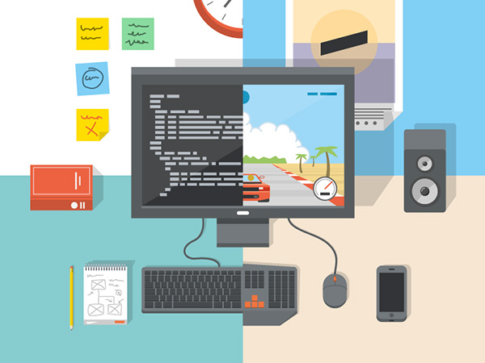

## The *Learn coding* module

:::: {.columns}

::: {.column width="70%"}

- only assumes basic computer familiarity

- introduce coding and Python

- focus on simple ways to develop software autonomously

- deploys modern tools such as VS Code and Git

- stresses code comprehension beyond GenAI shortcuts
:::

::: {.column width="30%"}

:::

::::

---

## a rich, sequential menu

  - The thinking/writing/coding/debugging/testing praxis
  - Data types and data structures
  - Conditional and loops
  - User input output
  - Text files
  - Functions
  - Data cleaning
  - Basic stats
  - Relational databases and their Structured query language \(SQL\) 
  - If time allows: basic Data Science methods 

---

## On module completion you will be able to:

- Write simple Python programs

- Start personal projects

- Understand the basics of algorithms and coding

- Use different data sources

- Visualize data

- Use SQL to query relational databases

---

:::: {.columns}
::: {.column width="50%"}

- local VS Code + Python, GitHub interactions  

- Basic structures, iterations & functions

- List, Dictionaries, Sets and Tuples

- Data visualisation: Matplotlib (w. some Seaborn)

- Numerical functions: Numpy

- Data ingestion, tables and time series: Pandas

:::
::: {.column width="50%"}

- Simple intro to relational DBMS

- SQL: Structured Query Language

- writing SQL queries to extract data

- embed SQL in Python

-  Developing a Case Study with Python

:::
::::

---

## Class style

- __Laptops on, smartphones off__ 

- __Lectures and labs mix up seamlessly__ 

- __use the Teams channel for quick questions__ 

- __have a Google and a GitHub account in your name__ 

---

## instructors

:::: {.columns}

::: {.column width="70%"}

- Alessandro Provetti

- PhD on AI for simplifying programming languages 

- Research on modeling user-generated data in *Social web* platforms

- Started the [Birkbeck Institute for Data Analytics](http://www.bida.bbk.ac.uk/)

:::

::: {.column width="30%"}

:::

::::

---

:::: {.columns}

::: {.column width="70%"}

- Alberto Matuozzo
  
- PhD in Machine Learning for Finance at Birkbeck, UK

- Research on Machine learning in Finance

:::

::: {.column width="30%"}

:::

::::

---

:::: {.columns}

::: {.column width="70%"}

- Federico Pilati

- PhD in Computational Social sciences at IULM, IT

- Post-doc at Université de Genève, CH

- Research on the emergence of online communities and misinformation  

:::

::: {.column width="30%"}

:::