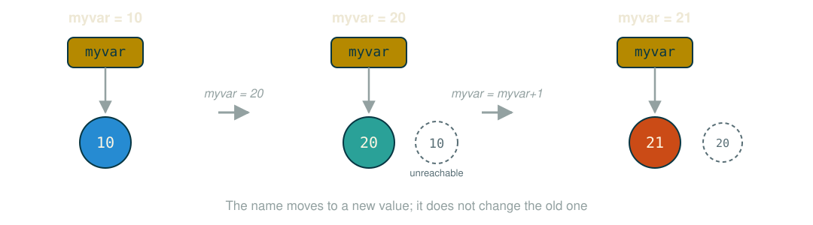
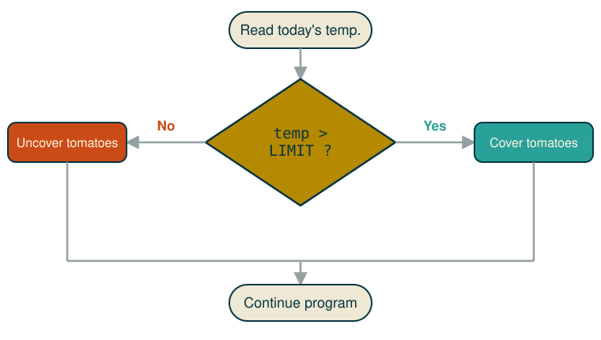

# Introduction

---

## Programming with Python

* simple & *chic* programming language; name comes from *Monty Python*

* easy: reading code is almost like reading English

* simplicity as a result of design:
  * focus on the problem, not on the language or on how data sits in memory
  * a way to represent an easy-to-read program

* free, open source, well-supported and maintained: VS Code, Jupyter, PyPI, Anaconda, Docker...


---

## Programming, one instruction at a time

* a *high-level* language: a fixed alphabet and grammar to describe instructions

* a program is a sequence of instructions

* an interpreter is software that reads progrms and maps each instruction into low-level commands
  
* the OS system maps low-level into executable commands for the specific hardware underneath 


---


even adding two numbers requires visibility of RAM and the CPU:

```python
total_price =  price + vat
```

```text
load the number from memory location 2001 into the CPU
load the number from memory location 2003 into the CPU
add the two numbers in the CPU
store the result into location 2005
```

---

## Compiler or interpreter?

Compiler: creates a new executable file, e.g., *my_app.exe*

- fast, efficient execution
- needs an ad hoc user interface
- specific to the hardware platform 

Interpreter

- Python default mode

- executes the program inside its own memory
  
- easier to set up and control (chat with Python)

# Simple output

---

## Simple Python commands

```python
# Command to print number 10!
print(10)
```

* comments start with `#`
* `print` writes to the screen

. . .

```python
# find the result then print it
print(10 + 20)
print(10 + 2 * 20)
print((2 * 4) + 6)
print(2 ** 2)
```

---

## Printing text

```python
# prints on the screen:
print('Have a nice Autumn term!')
print()
```

text is delimited by single (`'...'`) or double (`"..."`) quotes.

Double quotes are needed when `'` is used inside the text, called *string*

each `print` corresponds to a new line of the output interface (the terminal)

---

```python
# Let's print two names
print('Ale')
print('Pro')
print()

# Or
print("Ale", "Pro")
# Or
print('Ale', 'Pro')
# Or
print('Ale ' + 'Pro')
```

# B: Variables

---

## Python Variables

programs manipulate data that sits in memory (RAM)

**variable:** a string name for a memory area (think Excel cells)

our variables are akin to both parameters and variables of mathematics

a funny `=` symbol assigns a value to the variable *on its left*

```python
name = 'Nik'
age = 24
```


---

## More examples

```python
# extract the value then print it
print(name)
print(name, age)
print(name, ', ', age)
```

. . .

```python
x = age + 10

print(x)
print(10 / x)       # beware of division by 0!
print(2 * x + y)    # what does it print?
```

::: notes
The last line raises `NameError: name 'y' is not defined` — `y` was never assigned. Worth running live.
:::

---

## Variables can change their content

an **assignment statement**, not a mathematical equation:

```python
fahrenheit = 9 / 5 * celsius + 32
```

. . . 


```python
# This is an assignment expression!
myvar = 10
print(myvar)

myvar = 20            # assign a new value
print(myvar)

myvar = myvar + 1
print(myvar)          # prints 21
```


---

## How memory looks like

{fig-alt="Three snapshots of a name myvar pointing first to 10, then to 20 with 10 left unreachable, then to 21" .r-stretch}

* assignment rebinds the **name** to a new value; it does not modify the old value in place

---

## Input 

reading from the keyboard: `enter`/`return` ends the input

```python
input()
```

assign the input to a variable: `<variable> = input(<prompt>)`

```python
# This is an input example
name = input("Please enter a name: ")
print(name)

# This is another input example
my_fav_num = input("What is your favorite number? ")
print("Your favorite number is ", my_fav_num)
```

---

## More than one input

```python
# This is another input example
fName = input("Give first name: ")
lName = input("Give surname: ")
print(fName, lName)
```

every call to `input()` reads one line and always returns **text**

keep that in mind — it is the subject of the next section

---

## Quiz 2: fill the gaps

a) `________________`  `# print your name`

b) `________________`  `# print number 10`

c) `________________`  `# print the sum of 1 and 2`

. . .

**Solutions**

```python
a) print("Ale")   # print your name
b) print(10)           # print number 10
c) print(1+2)           # print the sum of 1 and 2
```

---

## Quiz 3: fill the gaps

```python
# Provide the command to prompt the user to enter a name
my_input = d) ________________("Enter your name: ")

# Provide the command to print the variable my_input
e) ________________(my_input)
```

. . .

**Solution**

```python
my_input = d) __input__("Enter your name: ")
e) __print__(my_input)
```

# C: Types

---

## Data types

* **Integers**: `x=10, y=100 ...`

* **Floats**: `pi=3.14, a=10.10, rate=0.0992929`

* **Strings** (text): `name='Ale', age='32'`

* **Boolean** (`True` or `False`, `1` or `0`): `headphones=True`

---

## Working with numbers

Python sees all keyboard input as **text**

to do arithmetic, convert text into a numerical representation: int(eger) or float or complex

```python
# The input is 10
x = input("Give a number")
print(x)
# x is text, even though it looks like a number
# This will print 10!

# This is another input
x = input("Give a number")
print(x + 20)
# Error! Python does not know that x is a number...
```

---

## What is the output?

```python
# This is an input
x = input("Give a number")
print(x * 2)
```

. . .

What does it print if the user enters `10`?

::: {.incremental}
- `20`
- an error...
- `1010` ← **correct**: `x` is text, so `*2` repeats it
:::

---

## Converting: string to integer

use `int(<value>)`

```python
# This is another input example
x = input("Give a number")
print(int(x) * 2)
```

What does it print if the user enters `10`?  **`20`**

. . .

```python
# Hint: if you expect an integer, convert the input directly
x = int(input("Give an integer number"))
print(x * 2)    # Will print 20!
```

---

## Converting: string to float

use `float(<value>)`

```python
# This is another input example
x = input("Give a number")
print(float(x) + 2)
```

What does it print if the user enters `10.5`? **`12.5`**

---

## Converting: int to string

use `str(<value>)`

```python
x = 10
print("ID" + x)          # error: can't add str and int
print("a" + str(x))      # correct: "a10"
```

---

## Recap

* basic data types: `Integer`, `Float`, `Complex`, `String` (text), `Boolean`

* converting types: `int(<value>)`, `float(<value>)`, `str(<value>)`

---

## Quiz 4

```python
a = input("give a number")
# The user enters 10
b = input("give a second number")
# The user enters 20
print(a + b)
```

What is the output?

. . .

**Solution**

If the input is `10` then `20`, this prints `1020` — both are still text.

```python
a = int(input("give a number"))     # 10
b = int(input("give a second number"))  # 20
print(a + b)   # This will print 30!
```

# D: Conditional execution

---

## Conditional execution

So far, every instruction in our program (a `.py` file) has run from top to bottom

Next, execution will be driven by the actual input data — a **decision diagram**

here decision means evaluating a `True`/`False` question; some parts of the code might never run


---

```python
LIMIT = 32
temp = int(input("Temp. Today?"))
if temp > LIMIT:
    # Notice the indentation
    print("Go cover the tomatoes!")
```

{fig-alt="A flowchart: read temperature, decide if it is above the limit, cover or uncover the tomatoes accordingly" .r-stretch}


---

## Python Conditionals

| operator | meaning |
|:--|:--|
| `a == b` | equals |
| `a != b` | not equals |
| `a < b` | less than |
| `a <= b` | less than or equal to |
| `a > b` | greater than |
| `a >= b` | greater than or equal to |

```python
a = 10
b = 9
if b < a:
    # Notice the indentation
    print("b is less than a")
```

---

## Conditionals: if/else

Syntax:

```python
if <condition>:
    <statement>
else:
    <statement>
```

```python
a = 10
b = 9
if b < a:
    print("b is less than a")
else:
    print("a is greater than b or equal")
```

---

## 3-way conditionals

Syntax:

```python
if <condition>:
    <statement>
elif <condition>:
    <statement>
else:
    <statement>
```

```python
a = 10
b = 9
if b < a:
    print("b is less than a")
elif b > a:
    print("b is greater than a")
else:
    print("a and b are equal")
```

---

## Quiz 6: fill the gaps

Print `"Hi"` if `a` is greater than or equal to `b`.

```python
a = 22
b = 82
_________ a _________ b _________
    print("Hi")
```

. . .

**Solution**

```python
a = 22
b = 82
if a >= b:
    print("Hi")
```

---

## Quiz 7: launch a VS Code

prompt the user for a number then print:

* `'Positive'` if the number is greater than 0
* `'Negative'` if the number is less than 0
* `'Zero'` otherwise

. . .

**Solution**

```python
user_input = int(input('Enter a number: '))

if user_input > 0:
    print('Positive')
elif user_input < 0:
    print('Negative')
else:
    print('Zero')
```

---

## General summary

* compiler vs. interpreter: Python is a line-by-line interpreter

* variables store data: name / type / value

* use `input()` to get data from the user, `print()` to output it

* data types: Integers, Floats, Strings (Text), Boolean

* `int()` converts text into numerical data; `float()` and `char()` work similarly

* `if` / `elif` / `else` create conditional, data-driven execution

# E: Expressions

---

## Recap quiz

```python
# 1
a = input("give a number")   # user inputs 10
b = input("give a number")   # user inputs 10
print(a + b)
# What does it print?
```
. . . 

```python
# 2
a = input("give a number")   # user inputs 10
b = input("give a number")   # user inputs 10
print(int(a) + b)
# What does it print?
```

---

## Solutions

```python
# 1
print(a + b)
# What does it print?
1010
```
. . .

```python
# 2
print(int(a) + b)
# What does it print?
ERROR!
TypeError: unsupported operand type(s) for +: 'int' and 'str'
```

---

## Logical operators

* **equal**: `10 == 10` → `True`; `if (a == 10): ...` tests a condition; `a = 10` *assigns* a value, it is not a condition
* **not equal**: `5 != 5` → `False`; `if (a != 0): print(10/a)`

```python
if (temp > 30) and (distance_to_beach < 50):
    print("Let's go to the beach!")

if (raining == True) or (day == "Sunday"):
    tea == True
```

---

## Booleans

A Boolean (or logical) expression evaluates to one of two states, `True` or `False`. Python's `bool` type holds one of them.

```python
x = int(input("Give a num: "))
enterTheIf = False
if x == 10:
    print("This is true!")
    enterTheIf = True
print(enterTheIf)
```

. . .

```python
# Another example!
a = int(input("Give a num: "))
isZero = False
if a == 0:
    isZero = True
if isZero == False:
    print(100 / a)
```

---

## Awkward run 1 — what's wrong?

```python
age = int(input("Enter your age "))

if (age < 10):
    print("You pay 5")
elif (age > 10 or age < 60):
    print("You pay 10")
elif (age > 60):
    print("You pay 4")
```

```text
Enter your age 70
You pay 10
```

please wait for all to finish

---

## Awkward run 2 — what's wrong?

Same code, different input:

```text
Enter your age 10
You pay 10
```

please wait for all to finish

::: notes
Both runs are wrong: age 70 should pay 4, and age 10 should pay 5. The bug is `or` in the second branch: `age > 10 or age < 60` is true for almost every number, so it swallows every case except the first.
:::

---

## Solution

The condition should be `and`, not `or`:

```python
age = int(input("Enter your age "))

if (age <= 10):
    print("You pay 5")
elif (age > 10 and age <= 60):
    print("You pay 10")
elif (age > 60):
    print("You pay 4")
```
